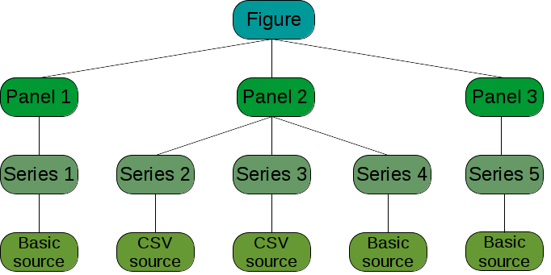
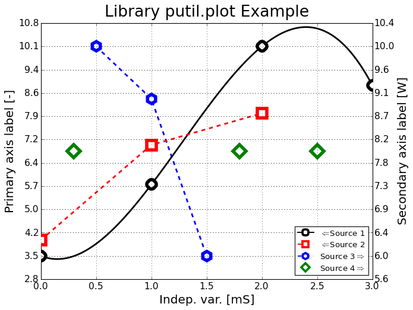

.. plot.rst
.. Copyright (c) 2013-2016 Pablo Acosta-Serafini
.. See LICENSE for details
.. py:module:: putil.plot

###########
plot module
###########

This module can be used to create high-quality, presentation-ready X-Y graphs
quickly and easily

***************
Class hierarchy
***************

The properties of the graph (figure in Matplotlib parlance) are defined in an
object of the :py:class:`putil.plot.Figure` class.

Each figure can have one or more panels, whose properties are defined by objects
of the :py:class:`putil.plot.Panel` class. Panels are arranged vertically in
the figure and share the same independent axis.  The limits of the independent
axis of the figure result from the union of the limits of the independent axis
of all the panels. The independent axis is shown by default in the bottom-most
panel although it can be configured to be in any panel or panels.

Each panel can have one or more data series, whose properties are defined by
objects of the :py:class:`putil.plot.Series` class. A series can be associated
with either the primary or secondary dependent axis of the panel. The limits of
the primary and secondary dependent axis of the panel result from the union of
the primary and secondary dependent data points of all the series associated
with each axis. The primary axis is shown on the left of the panel and the
secondary axis is shown on the right of the panel. Axes can be linear or
logarithmic.

The data for a series is defined by a source. Two data sources are provided:
the :py:class:`putil.plot.BasicSource` class provides basic data validation
and minimum/maximum independent variable range bounding. The
:py:class:`putil.plot.CsvSource` class builds upon the functionality of the
:py:class:`putil.plot.BasicSource` class and offers a simple way of accessing
data from a comma-separated values (CSV) file.  Other data sources can be
programmed by inheriting from the :py:class:`putil.plot.functions.DataSource`
abstract base class (ABC). The custom data source needs to implement the
following methods: :code:`__str__`, :code:`_set_indep_var` and
:code:`_set_dep_var`. The latter two methods set the contents of the
independent variable (an increasing real Numpy vector) and the dependent
variable (a real Numpy vector) of the source, respectively.

**Figure 1:** Example diagram of the class hierarchy of a figure. In
this particular example the figure consists of 3 panels. Panel 1 has a
series whose data comes from a basic source, panel 2 has three series, two
of which come from comma-separated values (CSV) files and one that comes
from a basic source. Panel 3 has one series whose data comes from a basic
source.

***************
Axes tick marks
***************

Axes tick marks are selected so as to create the most readable graph. Two
global variables control the actual number of ticks,
:py:data:`putil.plot.constants.MIN_TICKS` and
:py:data:`putil.plot.constants.SUGGESTED_MAX_TICKS`.
In general the number of ticks are between these two bounds; one or two more
ticks can be present if a data series uses interpolation and the interpolated
curve goes above (below) the largest (smallest) data point. Tick spacing is
chosen so as to have the most number of data points "on grid". Engineering
notation (i.e. 1K = 1000, 1m = 0.001, etc.) is used for the axis tick marks.

*******
Example
*******

.. literalinclude:: ./support/plot_example_1.py
    :language: python
    :tab-width: 4
    :lines: 1,6-10,19-119

|

.. csv-table:: data.csv file
   :file: ./support/data.csv
   :header-rows: 1

|

**Figure 2:** plot_example_1.png generated by plot_example_1.py

|

****************
Global variables
****************

.. autodata:: putil.plot.constants.AXIS_LABEL_FONT_SIZE
.. autodata:: putil.plot.constants.LINE_WIDTH
.. autodata:: putil.plot.constants.LEGEND_SCALE
.. autodata:: putil.plot.constants.MARKER_SIZE
.. autodata:: putil.plot.constants.MIN_TICKS
.. autodata:: putil.plot.constants.PRECISION
.. autodata:: putil.plot.constants.SUGGESTED_MAX_TICKS
.. autodata:: putil.plot.constants.TITLE_FONT_SIZE

*********
Functions
*********

.. autofunction:: putil.plot.parameterized_color_space

*******
Classes
*******

 .. autoclass:: putil.plot.functions.DataSource
	:members: __str__, _set_indep_var, _set_dep_var
	:show-inheritance:
 .. autoclass:: putil.plot.BasicSource
	:members: __str__, dep_var, indep_max, indep_min, indep_var
	:show-inheritance:
 .. autoclass:: putil.plot.CsvSource
	:members: __str__, dep_col_label, dep_var, fname, fproc, fproc_eargs,
	          indep_col_label, indep_max, indep_min, indep_var, rfilter
	:show-inheritance:
 .. autoclass:: putil.plot.Series
	:members: __str__, color, data_source, interp, label, line_style,
                  marker, secondary_axis
	:show-inheritance:
 .. autoclass:: putil.plot.Panel
	:members: display_indep_axis, legend_props, log_dep_axis,
	          primary_axis_label, primary_axis_scale, primary_axis_ticks,
                  primary_axis_units, secondary_axis_label,
                  secondary_axis_scale, secondary_axis_ticks,
                  secondary_axis_units, series, __bool__, __iter__,
                  __nonzero__, __str__
	:show-inheritance:
 .. autoclass:: putil.plot.Figure
	:members: axes_list, fig, fig_height, fig_width,
	          indep_axis_scale, indep_axis_ticks, indep_var_label,
                  indep_var_units, log_indep_axis, panels, save, show, title,
                  __bool__, __iter__, __nonzero__, __str__
	:show-inheritance:
